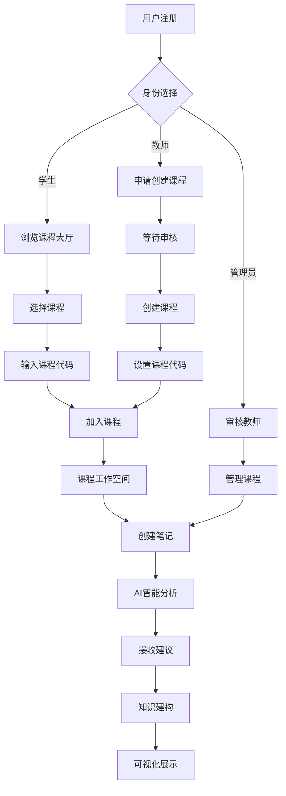

## 1. 产品概述

Human-AI Knowledge Interaction Forum是一个创新的在线协作学习平台，通过课程化的知识建构空间，结合AI智能助手提供个性化学习支持。

目标用户包括：

* 顶级管理员（审核教师注册）

* 教师（创建和管理课程）

* 学生（参与课程学习）

平台以"课程"为核心组织单位，每个课程拥有独立的知识建构空间，教师通过访问代码控制学生加入，确保课程成员的准确性。

## 2. 核心功能

### 2.1 用户角色

| 角色    | 注册方式        | 审核机制      | 核心权限                            |
| ----- | ----------- | --------- | ------------------------------- |
| 顶级管理员 | 系统预设        | 无需注册      | 审核教师注册、管理所有课程、系统配置              |
| 教师    | 邮箱注册 + 详细信息 | 需管理员审核通过  | 申请创建课程、设计课程代码、管理课程成员、查看学生数据     |
| 学生    | 邮箱注册 + 详细信息 | 无需审核，自由注册 | 加入课程（需课程代码）、创建笔记和视图、参与讨论、查看个人数据 |

**注册必填字段（所有用户）：**

* 中文姓名

* 拼音姓名（First Name + Family Name，必须英文）

* 邮箱地址

* 密码

* 手机号码

* 性别

* 所在学校

* 专业（学生）/ 专业领域（教师）

**注册选填字段：**

* 教师额外信息（职称、研究方向等）

* 学生年级

### 2.2 功能模块

Human-AI Knowledge Interaction Forum包含以下主要页面：

1. **首页**：登录注册、平台介绍、快速导航
2. **管理员审核面板**：待审核教师列表、审核操作
3. **教师课程申请面板**：申请创建课程、管理我的课程
4. **学生课程大厅**：浏览所有课程、输入代码加入课程
5. **课程工作空间**：空白画布、笔记编辑、视图管理、数据分析、分组功能
6. **个人中心**：个人资料编辑、学习历程、数据分析

### 2.3 页面详情

| 页面名称     | 模块名称    | 功能描述                                               |
| -------- | ------- | -------------------------------------------------- |
| 首页       | 登录注册    | 用户注册、登录、角色选择、基本信息填写（中文姓名、拼音姓名、邮箱、手机、学校、专业等）        |
| 首页       | 平台介绍    | 平台特色、使用指南、快速开始                                     |
| 管理员审核面板  | 待审核教师列表 | 显示待审核教师详细信息（姓名、学校、专业领域等）、批量审核操作                    |
| 管理员审核面板  | 审核操作    | 批准/拒绝注册、发送审核结果通知、审核历史记录                            |
| 教师课程申请面板 | 课程申请    | 填写课程名称、课程描述、设计课程访问代码、提交申请                          |
| 教师课程申请面板 | 我的课程管理  | 查看已创建课程列表、课程成员管理、课程设置                              |
| 学生课程大厅   | 课程浏览    | 所有可用课程卡片展示（课程名称、教师姓名、课程描述）、搜索筛选功能                  |
| 学生课程大厅   | 加入课程    | 点击加入课程按钮、输入课程访问代码弹窗、验证加入                           |
| 课程工作空间   | 空白画布    | 主要工作区域、支持多视图切换                                     |
| 课程工作空间   | 左侧工具栏   | 创建笔记、创建视图（Views）、数据分析、分组功能                         |
| 课程工作空间   | 顶部导航    | 视图切换按钮、个人资料入口、课程设置                                 |
| 笔记编辑器    | 富文本编辑   | 支持图片、文件上传、格式工具栏、多媒体内嵌                              |
| 笔记编辑器    | 脚手架提示   | 下拉选择模板（"我的理论是..."、"我需要理解..."、"我发现..."）、自定义脚手架、AI动态脚手架 |
| 笔记编辑器    | 互动功能    | 支持、提问、引用、批注、@提及、版本历史                               |
| 知识图谱视图   | 图谱展示    | 节点展示笔记、连线显示关系、头像标识、实时更新                            |
| 知识图谱视图   | 时间轴     | 版本历史、演化过程、修改对比、进度指标                                |
| 个人中心     | 个人资料    | 头像设置（支持自定义上传）、信息编辑、学习统计                            |
| 个人中心     | 学习历程    | 笔记历史、互动记录、成长曲线、AI帮助记录                              |
| AI助手面板   | 智能分析    | 内容分析、改进建议、连接推荐、学习模式识别                              |
| AI助手面板   | 行为管理    | AI触发设置、建议审查、参数调整、教师监控                              |

## 3. 核心流程

### 3.1 管理员流程

登录系统 → 查看待审核教师列表 → 审核教师信息 → 批准或拒绝注册 → 监控课程创建情况 → 管理异常课程

### 3.2 教师流程

注册账号 → 填写详细信息（姓名、邮箱、手机、学校、专业领域等） → 等待管理员审核 → 收到审核通过通知 → 登录系统 → 进入课程申请页面 → 填写课程信息（课程名称、描述、设计唯一的课程访问代码） → 提交申请 → 课程创建成功 → 进入课程工作空间 → 使用左侧工具栏（创建笔记、创建视图、数据分析、管理分组） → 顶部操作（切换不同视图、编辑个人资料）

### 3.3 学生流程

注册账号 → 填写详细信息（姓名、邮箱、手机、学校、专业等） → 注册成功立即登录 → 进入课程大厅页面 → 浏览所有教师创建的课程列表（显示课程名称、教师姓名、课程描述） → 选择想加入的课程 → 点击"加入课程" → 输入课程访问代码 → 验证成功后加入 → 进入课程工作空间 → 使用左侧工具栏（创建笔记、创建视图、数据分析、参与分组讨论） → 顶部操作（切换不同视图、编辑个人资料）



## 4. 用户界面设计

### 4.1 设计风格

* **主色调**：教育蓝 (#2563EB) 搭配温暖橙色 (#F59E0B)

* **辅助色**：中性灰系 (#6B7280, #9CA3AF) 和成功绿 (#10B981)

* **按钮样式**：圆角矩形，主要操作为实心按钮，次要操作为边框按钮

* **字体系统**：Inter 字体家族，标题 24-32px，正文 16px，小字 14px

* **布局风格**：卡片式布局，左侧导航，内容区域留白充足

* **图标风格**：使用 Lucide React 图标库，线性图标，保持简洁现代

### 4.2 页面设计概述

| 页面名称    | 模块名称 | UI元素                        |
| ------- | ---- | --------------------------- |
| 首页      | 登录注册 | 居中卡片设计，渐变背景，角色选择按钮，详细注册表单   |
| 管理员审核面板 | 教师列表 | 表格展示待审核教师，操作按钮（批准/拒绝），批量操作  |
| 教师课程申请  | 申请表单 | 卡片式表单，课程名称输入，描述文本域，课程代码设置   |
| 学生课程大厅  | 课程卡片 | 网格布局展示课程，卡片包含课程名、教师名、描述，搜索栏 |
| 课程工作空间  | 空白画布 | 全屏画布设计，左侧工具栏（图标+文字），顶部导航栏   |
| 笔记编辑器   | 编辑区域 | 左侧工具栏，顶部格式栏，富文本区域，脚手架下拉菜单   |
| 知识图谱视图  | 图谱展示 | 深色背景，彩色节点连线，头像标识，缩放控件       |
| 个人中心    | 统计面板 | 数据可视化图表，时间轴展示，进度条，学习曲线      |

### 4.3 响应式设计

* **桌面优先**：主要面向桌面端用户设计，确保复杂功能的可用性，特别是课程工作空间的画布操作

* **移动端适配**：支持平板和手机访问，核心功能完整保留，优化课程大厅的卡片布局

* **触摸优化**：笔记编辑和图谱操作针对触摸设备进行优化，简化移动端交互流程

* **响应式布局**：使用Tailwind CSS的响应式工具类进行适配，确保不同屏幕尺寸下的良好体验

* **课程导向**：课程工作空间支持全屏模式，适应不同教学场景需求

* **断点设置**：sm (640px), md (768px), lg (1024px), xl (1280px)

### 2.22 移动端适配策略（KF缺失功能的补充）

#### **响应式设计方案**：

**桌面端（>1024px）**：
- 三栏布局：[左侧工具栏] [中央画布] [右侧信息栏]
- 完整功能体验，适合复杂操作
- 支持鼠标悬停效果和右键菜单

**平板端（768-1024px）**：
- 折叠工具栏：默认收起，点击展开
- 中央画布全宽显示，优化触摸操作
- 简化交互，增大点击区域

**手机端（<768px）**：
- 顶部导航：[菜单☰] [视图▼] [搜索🔍]
- 底部标签栏：[笔记] [视图] [分析] [我的]
- 中央区域默认列表视图，支持切换

#### **移动端专属功能**：

**视图切换选项**：
- **列表视图**（默认）：垂直滚动，适合小屏幕
- **卡片视图**：2列网格布局，显示关键信息
- **时间轴视图**：按时间顺序垂直排列，便于快速浏览

**触摸优化**：
- 增大按钮和点击区域（最小44px）
- 支持滑动手势（左滑删除、右滑标记）
- 长按弹出上下文菜单
- 双击快速操作

**性能优化**：
- 懒加载笔记内容
- 图片压缩和延迟加载
- 离线缓存核心功能
- 减少动画效果，提升响应速度

#### **移动端界面布局**：
```
┌─────────────────────┐
│ ☰ 计算思维课程 ▼ 🔍 │  ← 顶部导航
├─────────────────────┤
│                     │
│    笔记列表          │  ← 主要内容区域
│ ┌─────────────────┐ │
│ │[头像] 笔记标题   │ │
│ │@作者名 · 2小时前 │ │
│ │内容预览...      │ │
│ └─────────────────┘ │
│                     │
├─────────────────────┤
│ 📝 👁️ 📊 👤        │  ← 底部导航
└─────────────────────┘
```

#### **功能优先级（移动端）**：
**核心功能**：
- 浏览和阅读笔记
- 创建简单笔记
- 查看通知和消息
- 搜索和筛选

**次要功能**：
- 复杂的知识图谱编辑
- 批量操作和管理
- 高级分析功能
- 详细的设置配置

**渐进式增强**：
- 基础功能保证可用性
- 高级功能根据设备性能启用
- 网络条件差时自动降级

## 5. 技术实现要点

### 5.1 核心功能优先级

1. **用户认证系统**：完整的注册登录流程，角色权限管理
2. **课程面板**：课程创建、加入、成员管理功能
3. **富文本编辑器**：支持图片插入、文件上传、格式编辑
4. **GenAI分析引擎**：调用Claude API进行内容分析和建议生成
5. **想法演化时间轴**：展示笔记版本变化和学习历程

### 5.2 技术栈选择

* **前端框架**：Next.js 14 with TypeScript

* **UI组件库**：shadcn/ui + Tailwind CSS

* **数据库**：Supabase (PostgreSQL)

* **AI服务**：Claude API、ChatGPT、DeepSeek、智谱清言、Kimi

* **可视化**：React Flow (知识图谱)、Chart.js (数据分析)

* **富文本编辑器**：TipTap 或 Slate.js

### 5.3 数据安全

* **行级安全策略**：启用Supabase RLS保护用户数据

* **API安全**：使用JWT token验证，API请求限流

* **隐私保护**：AI建议只针对公开笔记，私有内容加密存储


### 2.4 View（视图）功能详细规范

View是课程内的独立工作空间，类似Knowledge Forum的视图概念，用于组织不同主题或阶段的讨论。

**功能特性**：
- 教师和学生都可以创建View
- 每个View有独立的笔记集合
- View之间的笔记可以引用和链接
- 默认有一个"主视图"（Main View）
- 顶部下拉菜单切换View

**典型使用场景**：
- 教师创建"第一周讨论"、"第二周讨论"等View
- 学生创建"小组项目"View
- 按主题创建View："理论探讨"、"案例分析"等

### 2.5 课程访问代码规范

**代码格式要求**：
- 长度：6-12位字符
- 格式：字母+数字组合（例如：CS101A、MATH2024）
- 大小写敏感
- 不允许特殊字符（仅限字母和数字）
- 系统自动检查唯一性
- 教师可自定义或使用系统生成的随机代码

### 2.6 分组功能详细说明

分组是课程内的小组协作单元，用于小组项目或协作讨论。

**核心功能**：
- 教师和学生都可以创建分组
- 教师可以强制分配学生到分组
- 学生可以自由加入开放的分组
- 每个分组有独立的讨论区
- 分组可以有专属的View
- 分组内的笔记可以选择是否对课程公开

**分组类型**：
- 开放分组：学生自由加入
- 封闭分组：需要教师或组长批准
- 教师分配分组：教师直接分配成员

### 2.7 GenAI智能助手详细规范

#### **触发条件**：
1. **即时触发**：学生发布或更新笔记后2分钟内分析
2. **定期检查**：学生3天无活动时主动提醒
3. **教师请求**：教师可手动触发对特定笔记的分析
4. **批量分析**：每周日晚对所有活跃笔记进行深度分析

#### **分析维度**：
| 维度 | 检测指标 | AI判断标准 |
|------|---------|-----------|
| 论证深度 | 是否有理论支撑 | 词汇复杂度、论证结构、引用数量 |
| 证据质量 | 是否引用资料 | 是否包含引用、数据、案例 |
| 连接性 | 是否参考他人想法 | 是否@提及、引用其他笔记 |
| 完整性 | 论述是否清晰 | 段落结构、逻辑连贯性 |
| 停滞检测 | 是否长时间无进展 | 3天无编辑、无互动 |

#### **反馈呈现方式**：
- 笔记下方显示**浅蓝色AI建议卡片**
- 卡片包含：AI头像图标、建议文本、"有帮助"/"忽略"按钮
- 学生可点击"查看详情"展开完整分析
- 被忽略的建议不再重复出现
- 教师可在仪表板查看所有AI建议记录

#### **建议类型示例**：
- 🤔 深化提问："你能解释为什么会出现这种现象吗？"
- 📚 证据提示："这个观点可以用什么证据支持？"
- 🔗 连接建议："李明的笔记《关于XXX》可能与你的想法相关"
- 🎯 综合提示："你已经发布了3个相关笔记，可以尝试写一个综合笔记"
- ⚠️ 停滞提醒："你已经3天没有更新想法了，需要帮助吗？"

### 2.16 智能脚手架系统（AI动态脚手架）

#### **基础脚手架（教师预设）**：
类似于Knowledge Forum的静态脚手架，教师可以预设引导性问题：
- "我的理论是..."
- "我需要理解..."
- "证据支持..."
- "我发现..."
- "我的问题是..."

#### **AI动态脚手架（创新功能）**：
根据学生笔记内容实时生成个性化建议：

**内容检测触发**：
- **证据缺乏检测** → "你能提供数据支持这个观点吗？"
- **浅层推理检测** → "为什么会出现这种现象？背后的原理是什么？"
- **概念模糊检测** → "你能更清晰地定义这个概念吗？"
- **逻辑跳跃检测** → "这个结论是如何得出的？中间步骤是什么？"

**学习状态触发**：
- **停滞检测**（3天无进展）→ "你可以尝试从XX角度思考这个问题"
- **重复内容检测** → "你已经多次提到这个观点，能否提供新的视角？"
- **孤立笔记检测** → "你的这个笔记还没有与其他同学的想法连接"

**个性化调整**：
- **初学者模式**：提供更详细的步骤引导
- **进阶者模式**：提供开放式探索问题
- **专家模式**：提供挑战性思考和深度分析

#### **显示方式**：
```
┌─────────────────────────────┐
│ 📚 脚手架建议                │
├─────────────────────────────┤
│ 教师预设：                   │
│ • 我的理论是...              │
│ • 证据支持...                │
│                             │
│ 🤖 AI建议（基于你的内容）：    │
│ • 你能解释为什么...？         │
│   [应用] [忽略]              │
│ • 尝试从XX角度思考...        │
│   [应用] [忽略]              │
└─────────────────────────────┘
```

#### **智能推荐算法**：
1. **语义分析**：使用NLP分析笔记内容的深度和完整性
2. **知识图谱**：基于课程知识图谱推荐相关概念和连接
3. **学习历史**：根据学生过往表现调整建议难度
4. **同伴对比**：参考其他同学的高质量笔记模式
5. **课程进度**：结合课程时间安排合适的建议类型

### 2.8 课程工作空间详细布局

#### **整体结构**：
```
┌────────────────────────────────────────────────────────────┐
│ 顶部导航栏（高度60px）                                        │
│ [课程名称] [View切换下拉菜单▼] [通知🔔] [头像👤▼]              │
├──────────┬─────────────────────────────────────────────────┤
│          │                                                 │
│  左侧    │                                                 │
│  工具栏   │          中央画布区域                             │
│ (宽200px)│      （显示当前View的所有笔记）                    │
│          │                                                 │
│ 📝 笔记   │   ┌──────┐  ┌──────┐  ┌──────┐                │
│ 👁️ 视图   │   │笔记1 │  │笔记2 │  │笔记3 │                │
│ 📊 分析   │   │ 头像  │  │ 头像  │  │ 头像  │                │
│ 👥 分组   │   └──────┘  └──────┘  └──────┘                │
│ ⚙️ 设置   │          ↑ 可拖拽排列                           │
│          │                                                 │
└──────────┴─────────────────────────────────────────────────┘
```

#### **左侧工具栏简化设计（基于KF优化）**：

**核心功能（始终可见）**：
- 📝 **创建笔记** - 快速创建新笔记
- 👁️ **创建视图** - 管理不同主题的View
- 📊 **数据分析** - 查看课程数据统计
- 👥 **分组管理** - 管理小组协作

**高级功能（折叠菜单）**：
- ⚙️ **更多工具** ▼
  - 🔍 **高级搜索** - 全文搜索和筛选
  - 📈 **词频分析** - 关键词提取和词云
  - 🏷️ **标签管理** - 管理笔记标签
  - 📎 **附件管理** - 管理课程文件
  - ⚡ **AI助手设置** - 配置AI建议参数

**设计原则**：
- 只显示最常用的4-5个功能（核心功能）
- 使用通用图标（Lucide React）
- 文字简洁（2-4个字）
- 次要功能放入"更多工具"折叠菜单
- 可折叠（点击收起按钮只显示图标）
- 鼠标悬停显示工具提示
- 当前选中项高亮显示

#### **中央画布行为**：
- **默认显示**：卡片式排列所有笔记（3-4列网格）
- **可选视图**：
  - 卡片视图（默认）
  - 列表视图（紧凑显示）
  - 知识图谱视图（节点连线）
  - 时间轴视图（按时间排序）
- **笔记卡片**：显示头像、标题、前50字内容、互动数
- **拖拽功能**：可拖拽笔记改变位置（位置会保存）
- **快速操作**：鼠标悬停显示"打开"、"快速回复"按钮

### 2.9 通知系统

#### **通知类型**：
| 通知场景 | 接收者 | 触发时机 | 通知方式 |
|---------|--------|---------|---------|
| 教师审核通过 | 教师 | 管理员批准后立即 | 站内+邮件 |
| 学生加入课程 | 教师 | 学生成功加入后 | 站内通知 |
| 笔记被回复 | 笔记作者 | 有人build-on时 | 站内+可选邮件 |
| 笔记被@提及 | 被提及用户 | 发布包含@的笔记 | 站内+可选邮件 |
| AI建议生成 | 笔记作者 | AI分析完成后 | 站内通知 |
| 分组邀请 | 被邀请学生 | 收到邀请时 | 站内通知 |

#### **通知中心**：
- 顶部导航栏显示未读通知数量
- 点击展开通知列表（最近20条）
- 通知分类：系统通知、互动通知、AI建议
- 支持标记已读、全部已读

### 2.10 边界情况和错误处理

#### **注册审核场景**：
- 教师注册被拒绝后，可在30天内重新提交申请
- 重新申请时需要修改被拒原因涉及的字段
- 连续3次被拒后需要联系管理员

#### **课程代码验证**：
- 学生输入错误代码3次后，显示"联系教师获取正确代码"提示
- 课程代码有效期：教师可设置代码过期时间
- 课程满员后自动停止接受新成员（可设置上限）

#### **密码重置**：
- 忘记密码通过邮箱重置
- 重置链接24小时有效
- 需要验证注册时填写的手机号后4位

#### **课程归档/删除**：
- 教师可以归档课程（学生只读，不能发布新笔记）
- 课程删除需要管理员批准
- 删除前自动导出课程数据并发送给教师

### 2.11 数据导出和备份功能

#### **教师导出权限**：
- 导出整个课程数据（JSON/CSV格式）
- 导出学生参与报告（PDF/Excel）
- 导出知识图谱（图片/SVG）
- 导出AI分析报告

#### **学生导出权限**：
- 导出个人笔记（Markdown/PDF）
- 导出学习历程报告
- 导出知识图谱（仅个人相关部分）

#### **管理员导出权限**：
- 导出平台使用数据
- 导出所有课程列表
- 导出用户统计

### 2.12 搜索功能

#### **学生课程大厅搜索**：
- 搜索范围：课程名称、教师姓名、课程描述
- 支持模糊搜索
- 支持筛选：按创建时间、成员数量、活跃度

#### **课程内搜索**：
- 搜索范围：笔记标题、内容、作者姓名、标签
- 高级筛选：按View、按笔记类型、按日期范围
- 支持全文搜索

#### **个人笔记搜索**：
- 快速查找自己的笔记
- 按标签筛选
- 按修改时间排序

### 2.13 权限管理细则

#### **教师权限**：
- ✅ 可以编辑/删除自己的笔记
- ✅ 可以查看所有学生的笔记
- ✅ 可以隐藏（不能删除）学生的不当内容
- ✅ 可以移除学生出课程
- ✅ 可以关闭/开启课程注册
- ✅ 可以设置课程为只读模式

#### **学生权限**：
- ✅ 可以编辑/删除自己的笔记
- ✅ 可以主动退出课程
- ❌ 不能删除他人笔记
- ❌ 不能移除其他成员

#### **管理员权限**：
- ✅ 查看所有课程（只读模式）
- ✅ 删除违规课程
- ✅ 暂停用户账号
- ✅ 查看平台统计数据
- ❌ 不能编辑课程内容（保持中立）

### 2.14 课程生命周期管理

#### **课程状态**：
- 活跃（Active）：正常使用
- 只读（Read-Only）：教师设置，学生只能查看
- 归档（Archived）：学期结束后归档
- 删除（Deleted）：管理员删除

#### **课程复制**：
- 教师可以复制往期课程作为模板
- 复制时可选择：仅复制结构、包含笔记、包含成员

#### **学期管理**：
- 教师可以设置课程学期（开始-结束日期）
- 学期结束后自动提示归档

### 2.15 知识图谱可视化详细说明

#### **显示位置**：
- 在课程工作空间中，点击左侧工具栏"图谱视图"按钮
- 画布区域切换为知识图谱模式

#### **节点设计规范（基于KF优化）**：

**统一节点样式**：
- 所有笔记节点统一使用"头像+标题"卡片设计
- 尺寸：150x120px（固定大小）
- 圆角卡片，带阴影效果
- 布局结构：
```
┌────────────────┐
│  [头像图片]     │  ← 作者头像（40x40px）
│  笔记标题...    │  ← 标题（最多2行，超出省略）
│  @作者名        │  ← 作者信息
│  [类型图标]     │  ← 笔记类型图标
└────────────────┘
```

**节点分层设计**：
- 头像区域：显示作者头像，圆形40x40px
- 标题区域：显示笔记标题，最多显示2行
- 作者信息：显示@作者名
- 类型图标：显示笔记类型的小图标

**颜色编码系统**：
- **标准笔记**：白色背景 + 蓝色边框 (#2563EB)
- **接续笔记**：浅绿色背景 + 绿色边框 (#10B981)
- **综合笔记**：浅紫色背景 + 紫色边框 (#8B5CF6)
- **AI提示**：浅橙色背景 + 橙色边框 (#F59E0B)

**连线规则（清晰化设计）**：
- **实线箭头 →**：Build-on（接续关系）
- **虚线箭头 ⇢**：Reference（引用关系）
- **双向箭头 ⇄**：互相引用
- **连线颜色**：与源节点类型颜色匹配
- **连线粗细**：主关系用2px，次要关系用1px
- **避免交叉**：智能路径规划，减少视觉混乱

#### **交互功能**：
- 点击节点：弹出笔记预览卡片
- 双击节点：打开笔记详情页面
- 拖拽节点：调整位置（自动保存布局）
- 缩放：鼠标滚轮或触摸手势
- 筛选：按作者、按时间范围、按笔记类型
- 悬停效果：节点放大10%，显示完整标题
- 连线高亮：悬停节点时，相关连线高亮显示

### 2.17 现代化笔记详情页设计

#### **顶部操作栏**：
```
[← 返回] [编辑] [Build-on] [更多 ▼]
```

**操作按钮说明**：
- **返回**：返回上一页或课程工作空间
- **编辑**：进入编辑模式（仅作者可用）
- **Build-on**：基于当前笔记创建接续笔记
- **更多**：包含分享、导出、打印、删除等操作

#### **主体区域（卡片式设计）**：
```
┌──────────────────────────────────────┐
│ [头像] 作者名 · 2025/11/15 11:28     │
│ ──────────────────────────────────   │
│ # 笔记标题                            │
│                                      │
│ 笔记正文内容...                       │
│ [图片内嵌显示]                        │
│ [文件预览]                            │
│                                      │
│ 🏷️ 标签：#知识建构 #协作学习          │
└──────────────────────────────────────┘
```

**设计特点**：
- 清晰的信息层次结构
- 支持多媒体内容内嵌显示
- 标签系统便于分类和搜索
- 时间戳显示创建/修改时间

#### **右侧边栏（固定定位）**：
```
┌─────────────────┐
│ 📊 互动统计      │
│ • 12人查看       │
│ • 3个Build-on   │
│ • 5个引用        │
│                 │
│ 🔗 连接关系      │
│ Build-on自：     │
│ → [笔记A]       │
│                 │
│ 被引用于：       │
│ → [笔记B]       │
│ → [笔记C]       │
│                 │
│ 🤖 AI建议       │
│ [AI卡片]        │
└─────────────────┘
```

#### **底部标签页系统**：
```
[Read] [Edit] [Connections] [Threads] [History] [Rating] [Properties]
```

**标签页功能**：
- **Read**：阅读模式（默认），显示完整内容
- **Edit**：编辑模式（作者专用）
- **Connections**：显示所有连接关系（Build-on、引用）
- **Threads**：讨论线程，显示所有回复和讨论
- **History**：版本历史，显示修改记录
- **Rating**：评分和反馈，显示用户评价
- **Properties**：笔记属性（权限、元数据等）

### 2.18 Build-on（接续笔记）功能详细规范

#### **功能定义**：
Build-on是在他人笔记基础上继续发展想法的核心协作功能，是知识建构的重要机制。

#### **操作流程**：
1. **触发Build-on**：
   - 在笔记详情页点击"Build-on"按钮
   - 在知识图谱中右键节点选择"Build-on"
   - 在笔记卡片悬停菜单中选择"Build-on"

2. **创建新笔记**：
   - 自动打开新笔记编辑器
   - 顶部显示"接续自：[原笔记标题]"（可点击跳转）
   - 可选引用原笔记内容片段
   - 保持原笔记的View和课程关联

3. **发布和关联**：
   - 发布后自动建立Build-on关系
   - 在知识图谱中显示箭头连线（新笔记→原笔记）
   - 原笔记详情页显示"被Build-on"计数和列表

#### **可视化展示**：

**原笔记详情页显示**：
```
被Build-on 3次：
→ [学生A的笔记] "关于计算思维的进一步思考" (2天前)
→ [学生B的笔记] "我对这个观点的补充" (1天前)  
→ [学生C的笔记] "整合大家的观点" (刚刚)
```

**知识图谱显示**：
- 实线箭头表示Build-on关系
- 箭头方向：新笔记 → 原笔记
- 节点颜色编码与笔记类型一致

#### **Build-on类型**：
- **扩展型**：在原有观点基础上添加新内容
- **质疑型**：对原有观点提出不同看法
- **整合型**：综合多个相关观点
- **应用型**：将观点应用到新情境

#### **激励机制**：
- 被Build-on的笔记获得活跃度加分
- 高质量Build-on获得教师表扬
- Build-on链条形成讨论线程
- 促进深度思考和知识建构

### 2.19 Threads（讨论线程）功能详细规范

#### **功能定义**：
Threads是围绕一个笔记展开的一系列Build-on和回复形成的讨论树，展示知识的演进和讨论的层次结构。

#### **可视化展示**：
```
原笔记：知识建构的核心理念
  ├─ Build-on 1: 我对这个理念的理解
  │   └─ Build-on 1.1: 补充一个案例
  ├─ Build-on 2: 我有不同的看法
  │   ├─ Build-on 2.1: 我同意这个观点
  │   └─ Build-on 2.2: 但是我认为...
  └─ Build-on 3: 整合大家的观点
```

#### **功能特性**：
- **树状结构**：清晰显示讨论层级和演进路径
- **折叠/展开**：用户可以折叠不需要关注的分支
- **高亮显示**：新回复和活跃讨论自动高亮
- **作者筛选**：可以只查看特定作者的回复
- **时间排序**：按时间顺序或相关性排序

#### **交互设计**：
- **点击展开**：点击节点展开子线程
- **快速回复**：在每个节点旁显示"回复"按钮
- **跳转到原笔记**：点击节点标题跳转到完整笔记
- **显示统计**：显示每个分支的回复数量

#### **Threads标签页内容**：
在笔记详情页的Threads标签中显示：
```
┌──────────────────────────────────────┐
│ 讨论线程 (共8条Build-on)               │
│                                      │
│ ▼ 我对这个理念的理解 (张三, 2天前)      │
│   我认为知识建构的核心在于...          │
│   ├─▶ 补充一个案例 (李四, 1天前)        │
│   │    在实际教学中，我发现...         │
│   │                                  │
│ ├─▶ 我有不同的看法 (王五, 1天前)        │
│ │  虽然同意基本理念，但是...            │
│ │   ├─▶ 我同意这个观点 (赵六, 3小时前)  │
│ │   │    确实，从实践角度来看...        │
│ │   └─▶ 但是我认为... (孙七, 1小时前)   │
│ │        还需要考虑学习者的差异性...    │
│ │                                  │
│ ▶ 整合大家的观点 (周八, 30分钟前)       │
│   综合以上讨论，我认为...              │
└──────────────────────────────────────┘
```

### 2.20 视图（View）管理优化

#### **顶部视图栏设计**：
```
┌──────────────────────────────────────────────┐
│ 📁 当前视图：主视图 ▼   [+ 新建视图] [管理]   │
└──────────────────────────────────────────────┘
```

#### **视图下拉菜单**：
```
┌─────────────────────────────┐
│ 我的视图                     │
│ ✓ 主视图（150个笔记）         │
│   第一周讨论（23个笔记）      │
│   小组项目（8个笔记）         │
│ ─────────────────────       │
│ 共享视图                     │
│   教师：知识建构专题（45个）   │
│   张三：案例分析（12个）      │
│ ─────────────────────       │
│ [+ 创建新视图]               │
└─────────────────────────────┘
```

#### **新建视图对话框**：
```
┌─────────────────────────────┐
│ 创建新视图                   │
│                             │
│ 视图名称：                   │
│ [____________]              │
│                             │
│ 可见性：                     │
│ ○ 仅自己可见                │
│ ○ 课程成员可见              │
│ ○ 小组成员可见              │
│                             │
│ 描述（可选）：               │
│ [____________]              │
│                             │
│      [取消] [创建]          │
└─────────────────────────────┘
```

#### **视图功能增强**：
- **视图统计**：显示每个视图包含的笔记数量
- **最近使用**：自动排序最近使用的视图
- **视图搜索**：支持搜索视图名称和描述
- **批量管理**：支持批量删除、归档视图
- **视图模板**：提供预设模板（讨论、项目、研究等）

### 2.21 关键词/词频分析功能

#### **功能位置**：
左侧工具栏 → 数据分析 → 关键词分析

#### **功能描述**：
- **自动提取**：分析课程/视图中所有笔记的高频关键词
- **词云可视化**：生成美观的词云图，字体大小表示词频
- **趋势分析**：显示关键词随时间的变化趋势
- **点击交互**：点击关键词查看包含该词的所有笔记
- **导出功能**：支持导出词频统计报表

#### **应用场景**：
- **教师**：了解课程讨论热点和核心概念
- **学生**：发现知识盲点和热门话题
- **研究分析**：识别学习社区的知识建构模式

#### **词频分析界面**：
```
┌──────────────────────────────────────┐
│ 关键词分析 - 计算思维课程              │
│                                      │
│ 📊 词云图                           │
│  [知识建构] [计算思维] [协作学习]      │
│     [问题解决] [算法] [编程]         │
│        [数据] [逻辑] [创新]          │
│                                      │
│ 📈 趋势分析                         │
│ 知识建构 ↑↑↑ 计算思维 ↑↑ 协作学习 ↑  │
│                                      │
│ 🔍 高频词汇（TOP 10）                │
│ 1. 知识建构 (45次) ■■■■■■■■■■        │
│ 2. 计算思维 (38次) ■■■■■■■■■        │
│ 3. 协作学习 (32次) ■■■■■■■■          │
│ 4. 问题解决 (28次) ■■■■■■■           │
│ 5. 算法 (25次) ■■■■■■                │
│                                      │
│ [导出报表] [刷新分析] [?]             │
└──────────────────────────────────────┘
```