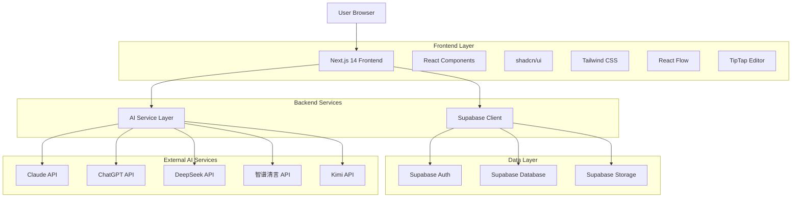
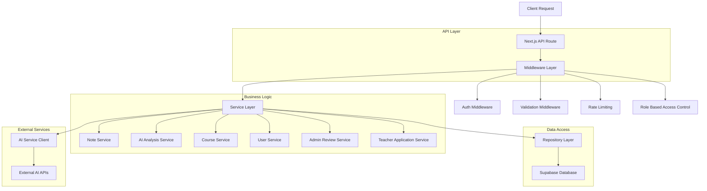
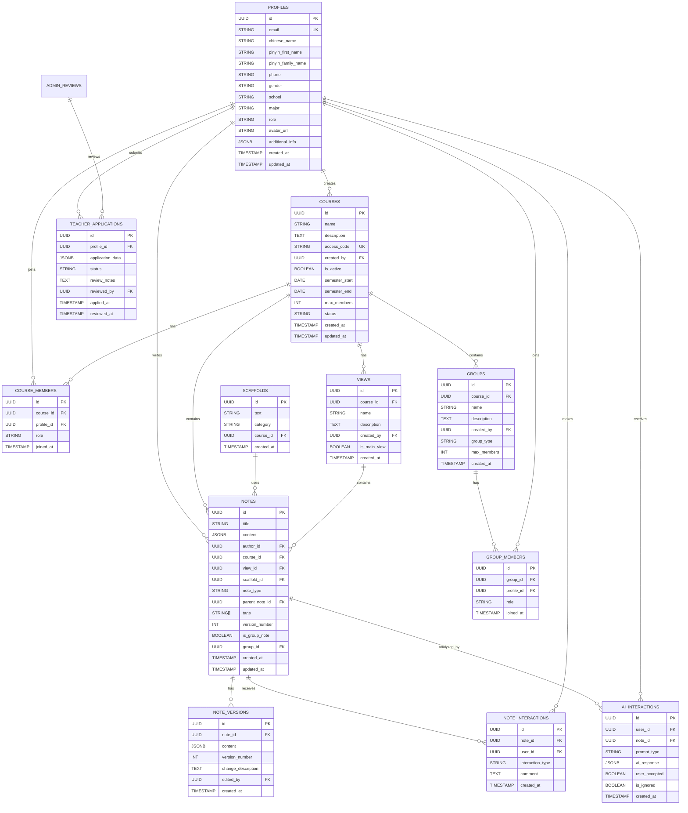

## 1. 架构设计

### 1.1 UI/UX设计规范

基于Knowledge Forum优化经验，制定以下设计规范：

#### **左侧工具栏设计规范**：
```typescript
// 工具栏配置接口
interface ToolbarConfig {
  coreTools: ToolItem[];      // 核心功能（4-5个）
  advancedTools: ToolItem[];  // 高级功能（折叠菜单）
  designPrinciples: {
    iconLibrary: 'lucide-react';     // 使用Lucide图标
    textLength: '2-4 characters';    // 文字简洁
    layout: 'collapsible-sidebar';   // 可折叠设计
    responsive: {
      desktop: 'expanded',           // 桌面端展开
      tablet: 'collapsible',         // 平板可折叠
      mobile: 'bottom-navigation'      // 手机底部导航
    }
  }
}

// 工具项定义
interface ToolItem {
  id: string;
  icon: string;      // Lucide图标名称
  label: string;     // 2-4字中文标签
  tooltip: string;   // 完整功能描述
  category: 'core' | 'advanced';
}
```

#### **知识图谱节点设计规范**：
```typescript
// 节点样式配置
interface NodeStyleConfig {
  dimensions: {
    width: 150;       // 固定宽度150px
    height: 120;      // 固定高度120px
    avatarSize: 40;   // 头像40x40px
    borderRadius: 8;  // 圆角8px
  }
  colorScheme: {
    standard: {
      background: '#ffffff';    // 白色背景
      border: '#2563EB';        // 蓝色边框
      text: '#1f2937';          // 深灰文字
    }
    response: {
      background: '#f0fdf4';    // 浅绿背景
      border: '#10B981';        // 绿色边框
      text: '#1f2937';
    }
    synthesis: {
      background: '#faf5ff';    // 浅紫背景
      border: '#8B5CF6';        // 紫色边框
      text: '#1f2937';
    }
    aiPrompt: {
      background: '#fff7ed';    // 浅橙背景
      border: '#F59E0B';        // 橙色边框
      text: '#1f2937';
    }
  }
  layout: {
    titleLines: 2;      // 标题最多2行
    showAvatar: true;   // 显示作者头像
    showAuthor: true;   // 显示作者名称
    showTypeIcon: true; // 显示类型图标
  }
}

// 连线样式配置
interface EdgeStyleConfig {
  buildOn: {
    type: 'solid';     // 实线
    arrow: '→';        // 箭头符号
    width: 2;           // 线宽2px
    color: '#10B981';  // 绿色
  }
  reference: {
    type: 'dashed';    // 虚线
    arrow: '⇢';        // 虚线箭头
    width: 1;           // 线宽1px
    color: '#6B7280';  // 灰色
  }
  bidirectional: {
    type: 'solid';
    arrow: '⇄';        // 双向箭头
    width: 2;
    color: '#8B5CF6';  // 紫色
  }
}
```

#### **笔记详情页设计规范**：
```typescript
// 详情页布局配置
interface NoteDetailLayout {
  header: {
    height: 60;                    // 顶部栏高度60px
    actions: ['back', 'edit', 'build-on', 'more']; // 操作按钮
  }
  content: {
    layout: 'card-design';          // 卡片式设计
    maxWidth: '800px';             // 最大宽度800px
    padding: '24px';               // 内边距24px
  }
  sidebar: {
    width: '300px';                // 侧边栏宽度300px
    position: 'fixed-right';       // 右侧固定
    sections: ['stats', 'connections', 'ai-suggestions'];
  }
  tabs: {
    items: ['Read', 'Edit', 'Connections', 'Threads', 'History', 'Rating', 'Properties'];
    position: 'bottom';            // 底部标签页
    style: 'pills';                // 药丸式样式
  }
}
```

#### **移动端适配规范**：
```typescript
// 响应式断点配置
interface ResponsiveBreakpoints {
  mobile: {
    maxWidth: '768px';
    layout: 'single-column';      // 单列布局
    navigation: 'bottom-tabs';     // 底部标签导航
    gestures: {
      swipe: 'left-delete-right-star'; // 左滑删除，右滑收藏
      longPress: 'context-menu';       // 长按上下文菜单
      doubleTap: 'quick-action';       // 双击快速操作
    }
  }
  tablet: {
    minWidth: '768px';
    maxWidth: '1024px';
    layout: 'collapsible-sidebar'; // 可折叠侧边栏
    navigation: 'top-toolbar';      // 顶部工具栏
  }
  desktop: {
    minWidth: '1024px';
    layout: 'three-column';         // 三栏布局
    navigation: 'full-sidebar';       // 完整侧边栏
  }
}

// 移动端视图配置
interface MobileViewConfig {
  defaultView: 'list';              // 默认列表视图
  availableViews: ['list', 'card', 'timeline'];
  listView: {
    itemHeight: '80px';            // 列表项高度80px
    showAvatar: true;
    showPreview: true;              // 显示内容预览
    maxPreviewLines: 2;             // 最多2行预览
  }
  cardView: {
    columns: 2;                     // 2列网格
    cardHeight: '120px';            // 卡片高度120px
    showImage: false;               // 不显示图片（节省空间）
  }
}
```

**教师申请表 (teacher_applications)**
```sql
-- 创建表
CREATE TABLE teacher_applications (
    id UUID PRIMARY KEY DEFAULT gen_random_uuid(),
    applicant_id UUID REFERENCES profiles(id) ON DELETE CASCADE,
    application_info JSONB NOT NULL,
    status VARCHAR(50) DEFAULT 'pending' CHECK (status IN ('pending', 'approved', 'rejected')),
    reviewed_by UUID REFERENCES profiles(id),
    review_comment TEXT,
    applied_at TIMESTAMP WITH TIME ZONE DEFAULT NOW(),
    reviewed_at TIMESTAMP WITH TIME ZONE
);

-- 创建索引
CREATE INDEX idx_teacher_applications_status ON teacher_applications(status);
CREATE INDEX idx_teacher_applications_applied_at ON teacher_applications(applied_at DESC);

-- Views 表
CREATE TABLE views (
    id UUID PRIMARY KEY DEFAULT gen_random_uuid(),
    course_id UUID NOT NULL REFERENCES courses(id) ON DELETE CASCADE,
    name VARCHAR(100) NOT NULL,
    description TEXT,
    created_by UUID NOT NULL REFERENCES profiles(id),
    is_main_view BOOLEAN DEFAULT FALSE,
    created_at TIMESTAMP WITH TIME ZONE DEFAULT NOW(),
    updated_at TIMESTAMP WITH TIME ZONE DEFAULT NOW()
);

-- 创建索引
CREATE INDEX idx_views_course_id ON views(course_id);
CREATE INDEX idx_views_created_by ON views(created_by);

-- Groups 表
CREATE TABLE groups (
    id UUID PRIMARY KEY DEFAULT gen_random_uuid(),
    course_id UUID NOT NULL REFERENCES courses(id) ON DELETE CASCADE,
    name VARCHAR(100) NOT NULL,
    description TEXT,
    created_by UUID NOT NULL REFERENCES profiles(id),
    group_type VARCHAR(20) NOT NULL CHECK (group_type IN ('open', 'closed', 'assigned')),
    max_members INTEGER DEFAULT 10,
    created_at TIMESTAMP WITH TIME ZONE DEFAULT NOW(),
    updated_at TIMESTAMP WITH TIME ZONE DEFAULT NOW()
);

-- 创建索引
CREATE INDEX idx_groups_course_id ON groups(course_id);
CREATE INDEX idx_groups_created_by ON groups(created_by);

-- Group Members 表
CREATE TABLE group_members (
    id UUID PRIMARY KEY DEFAULT gen_random_uuid(),
    group_id UUID NOT NULL REFERENCES groups(id) ON DELETE CASCADE,
    profile_id UUID NOT NULL REFERENCES profiles(id) ON DELETE CASCADE,
    role VARCHAR(20) DEFAULT 'member' CHECK (role IN ('leader', 'member')),
    joined_at TIMESTAMP WITH TIME ZONE DEFAULT NOW(),
    UNIQUE(group_id, profile_id)
);

-- 创建索引
CREATE INDEX idx_group_members_group_id ON group_members(group_id);
CREATE INDEX idx_group_members_profile_id ON group_members(profile_id);

-- Notifications 表
CREATE TABLE notifications (
    id UUID PRIMARY KEY DEFAULT gen_random_uuid(),
    profile_id UUID NOT NULL REFERENCES profiles(id) ON DELETE CASCADE,
    type VARCHAR(50) NOT NULL,
    title VARCHAR(200) NOT NULL,
    content TEXT,
    related_id UUID,
    related_type VARCHAR(50),
    is_read BOOLEAN DEFAULT FALSE,
    created_at TIMESTAMP WITH TIME ZONE DEFAULT NOW()
);

-- 创建索引
CREATE INDEX idx_notifications_profile_id ON notifications(profile_id);
CREATE INDEX idx_notifications_created_at ON notifications(created_at DESC);
CREATE INDEX idx_notifications_is_read ON notifications(is_read);

-- 更新 Notes 表的外键约束
ALTER TABLE notes ADD COLUMN view_id UUID REFERENCES views(id);
ALTER TABLE notes ADD COLUMN is_group_note BOOLEAN DEFAULT FALSE;
ALTER TABLE notes ADD COLUMN group_id UUID REFERENCES groups(id);

-- 创建索引
CREATE INDEX idx_notes_view_id ON notes(view_id);
CREATE INDEX idx_notes_group_id ON notes(group_id);
CREATE INDEX idx_notes_is_group_note ON notes(is_group_note);

-- 更新 AI_INTERACTIONS 表
ALTER TABLE ai_interactions ADD COLUMN is_ignored BOOLEAN DEFAULT FALSE;

-- 权限设置
GRANT SELECT ON teacher_applications TO anon;
GRANT ALL PRIVILEGES ON teacher_applications TO authenticated;

GRANT SELECT ON views TO anon;
GRANT ALL PRIVILEGES ON views TO authenticated;

GRANT SELECT ON groups TO anon;
GRANT ALL PRIVILEGES ON groups TO authenticated;

GRANT SELECT ON group_members TO anon;
GRANT ALL PRIVILEGES ON group_members TO authenticated;

GRANT SELECT ON notifications TO anon;
GRANT ALL PRIVILEGES ON notifications TO authenticated;

-- 行级安全策略
ALTER TABLE teacher_applications ENABLE ROW LEVEL SECURITY;

-- 管理员可查看所有申请
CREATE POLICY "Admins can view all applications" 
    ON teacher_applications FOR SELECT 
    USING (
        EXISTS (
            SELECT 1 FROM profiles 
            WHERE profiles.id = auth.uid() 
            AND profiles.role = 'admin'
        )
    );

-- 教师可查看自己的申请
CREATE POLICY "Teachers can view own application" 
    ON teacher_applications FOR SELECT 
    USING (applicant_id = auth.uid());

-- 管理员可以更新申请状态
CREATE POLICY "Admins can update application status" 
    ON teacher_applications FOR UPDATE 
    USING (
        EXISTS (
            SELECT 1 FROM profiles 
            WHERE profiles.id = auth.uid() 
            AND profiles.role = 'admin'
        )
    );


## 2. 技术描述

### 2.1 核心技术栈
- **前端框架**：Next.js 14 + TypeScript 5 + React 18
- **UI组件库**：shadcn/ui + Tailwind CSS + Radix UI
- **初始化工具**：create-next-app
- **数据库**：Supabase (PostgreSQL 15)
- **认证服务**：Supabase Auth with Row Level Security (RLS)
- **文件存储**：Supabase Storage
- **AI服务**：Claude API、OpenAI API、DeepSeek API、智谱清言 API、Kimi API
- **富文本编辑器**：TipTap 2
- **可视化库**：React Flow（知识图谱）、Chart.js（数据分析）、Framer Motion（动画）
- **状态管理**：React Context + SWR
- **表单处理**：React Hook Form + Zod
- **图标**：Lucide React
- **移动端**：React Responsive + Touch Events
- **词云生成**：d3-cloud + d3-scale

### 2.2 开发工具
- **包管理**：pnpm
- **代码质量**：ESLint + Prettier + Husky
- **类型检查**：TypeScript 5.0+
- **测试框架**：Jest + React Testing Library + Playwright（E2E测试）
- **部署平台**：Vercel (前端) + Supabase (后端)
- **性能监控**：Vercel Analytics + Sentry
- **移动端测试**：BrowserStack + Chrome DevTools

## 3. 路由定义

| 路由 | 目的 | 权限要求 |
|------|------|----------|
| `/` | 首页，登录注册 | 公开访问 |
| `/dashboard` | 仪表板，显示概览 | 需要认证 |
| `/admin/teacher-applications` | 管理员审核面板 | 管理员角色 |
| `/teacher/apply` | 教师课程申请 | 已认证教师 |
| `/teacher/courses` | 我的课程管理 | 已认证教师 |
| `/student/course-hall` | 学生课程大厅 | 已认证学生 |
| `/courses` | 课程列表页面 | 需要认证 |
| `/courses/new` | 创建新课程 | 已认证教师 |
| `/courses/:id` | 课程工作空间 | 课程成员 |
| `/courses/:id/join` | 加入课程（输入代码） | 已认证学生 |
| `/notes/new` | 创建新笔记 | 课程成员 |
| `/notes/:id` | 笔记详情页面 | 相关成员 |
| `/notes/:id/edit` | 编辑笔记 | 笔记作者 |
| `/profile` | 个人资料页面 | 需要认证 |
| `/analytics` | 数据分析页面 | 课程成员 |
| `/settings` | 系统设置 | 教师角色 |

## 4. API定义

### 4.1 核心API

**用户认证相关**
```
POST /api/auth/register
POST /api/auth/login
POST /api/auth/logout
```

请求参数（注册）：
| 参数名 | 类型 | 必需 | 描述 |
|--------|------|------|------|
| email | string | 是 | 用户邮箱 |
| password | string | 是 | 用户密码 |
| chineseName | string | 是 | 中文姓名 |
| pinyinFirstName | string | 是 | 拼音名 |
| pinyinFamilyName | string | 是 | 拼音姓 |
| phone | string | 是 | 手机号码 |
| gender | string | 是 | 性别：男/女/其他 |
| school | string | 是 | 所在学校 |
| major | string | 是 | 专业/专业领域 |
| role | string | 是 | 用户角色：student/teacher |
| additionalInfo | object | 否 | 额外信息（教师职称、研究方向等） |

**管理员相关**
```
GET /api/admin/teacher-applications
PUT /api/admin/teacher-applications/:id/review
GET /api/admin/courses
GET /api/admin/users
```

**教师申请相关**
```
POST /api/teacher/applications
GET /api/teacher/applications/status
```

**课程管理相关**
```
POST /api/courses
GET /api/courses
GET /api/courses/:id
PUT /api/courses/:id
DELETE /api/courses/:id
POST /api/courses/:id/join
GET /api/courses/:id/members
```

**笔记管理相关**
```
POST /api/notes
GET /api/notes
GET /api/notes/:id
PUT /api/notes/:id
DELETE /api/notes/:id
POST /api/notes/:id/interact
```

**AI分析相关**
```
POST /api/ai/analyze
POST /api/ai/suggest
GET /api/ai/interactions
```

**分组管理相关**
```
POST /api/courses/:id/groups
GET /api/courses/:id/groups
GET /api/groups/:id
PUT /api/groups/:id
DELETE /api/groups/:id
POST /api/groups/:id/join
POST /api/groups/:id/leave
GET /api/groups/:id/members
```

**视图管理相关**
```
POST /api/courses/:id/views
GET /api/courses/:id/views
GET /api/views/:id
PUT /api/views/:id
DELETE /api/views/:id
```

**搜索相关**
```
GET /api/search/courses
GET /api/search/notes
GET /api/search/users
```

**数据导出相关**
```
GET /api/export/course/:id
GET /api/export/user-notes
GET /api/export/analytics
```

**通知相关**
```
GET /api/notifications
PUT /api/notifications/:id/read
PUT /api/notifications/read-all
```

### 4.2 管理员审核API

**获取待审核教师列表**
```
GET /api/admin/teacher-applications
```

响应：
```json
{
  "applications": [
    {
      "id": "uuid",
      "applicant": {
        "id": "uuid",
        "chineseName": "张三",
        "pinyinFirstName": "San",
        "pinyinFamilyName": "Zhang",
        "email": "zhangsan@example.com",
        "phone": "13800138000",
        "school": "北京大学",
        "major": "计算机科学",
        "additionalInfo": {
          "title": "副教授",
          "researchArea": "人工智能"
        }
      },
      "status": "pending",
      "appliedAt": "2024-01-15T10:00:00Z"
    }
  ]
}
```

**审核教师申请**
```
PUT /api/admin/teacher-applications/:id/review
```

请求参数：
| 参数名 | 类型 | 必需 | 描述 |
|--------|------|------|------|
| action | string | 是 | 审核结果：approved/rejected |
| comment | string | 否 | 审核意见 |

### 4.3 教师申请API

**提交教师申请**
```
POST /api/teacher/applications
```

请求参数：
| 参数名 | 类型 | 必需 | 描述 |
|--------|------|------|------|
| title | string | 是 | 教师职称 |
| researchArea | string | 是 | 研究方向 |
| experience | string | 是 | 教学经验 |

### 4.4 课程管理API

**创建课程**
```
POST /api/courses
```

请求参数：
| 参数名 | 类型 | 必需 | 描述 |
|--------|------|------|------|
| name | string | 是 | 课程名称 |
| description | string | 是 | 课程描述 |
| accessCode | string | 是 | 课程访问代码（6-12位字母数字） |
| semesterStart | date | 否 | 学期开始日期 |
| semesterEnd | date | 否 | 学期结束日期 |
| maxMembers | number | 否 | 最大成员数，默认50 |

### 4.5 分组管理API

**创建分组**
```
POST /api/courses/:id/groups
```

请求参数：
| 参数名 | 类型 | 必需 | 描述 |
|--------|------|------|------|
| name | string | 是 | 分组名称 |
| description | string | 是 | 分组描述 |
| groupType | string | 是 | 分组类型：open/closed/assigned |
| maxMembers | number | 否 | 最大成员数，默认10 |

**加入分组**
```
POST /api/groups/:id/join
```

### 4.6 视图管理API

**创建视图**
```
POST /api/courses/:id/views
```

请求参数：
| 参数名 | 类型 | 必需 | 描述 |
|--------|------|------|------|
| name | string | 是 | 视图名称 |
| description | string | 是 | 视图描述 |
| isMainView | boolean | 否 | 是否为主视图，默认false |

### 4.7 搜索API

**搜索课程**
```
GET /api/search/courses?q=关键词&filter=筛选条件
```

**搜索笔记**
```
GET /api/search/notes?q=关键词&courseId=课程ID&viewId=视图ID
```

### 4.8 数据导出API

**导出课程数据**
```
GET /api/export/course/:id?format=json
```

支持格式：json, csv, pdf

**导出用户笔记**
```
GET /api/export/user-notes?format=markdown
```

支持格式：markdown, pdf, json

### 4.9 关键词分析API

**获取课程关键词分析**
```
GET /api/analytics/keywords?courseId=课程ID&timeRange=7d
```

响应：
```json
{
  "keywords": [
    {
      "word": "知识建构",
      "frequency": 45,
      "trend": "up",
      "relatedNotes": 23,
      "firstSeen": "2024-01-15T10:00:00Z",
      "lastSeen": "2024-01-22T15:30:00Z"
    }
  ],
  "wordCloud": {
    "svg": "<svg>...</svg>",
    "data": [
      {"text": "知识建构", "size": 45, "color": "#2563EB"},
      {"text": "计算思维", "size": 38, "color": "#10B981"}
    ]
  },
  "trends": {
    "timeRange": "7d",
    "data": [
      {"date": "2024-01-15", "keywords": ["知识建构", "协作学习"]},
      {"date": "2024-01-16", "keywords": ["计算思维", "问题解决"]}
    ]
  }
}
```

**生成词云图**
```
POST /api/analytics/wordcloud
```

请求参数：
| 参数名 | 类型 | 必需 | 描述 |
|--------|------|------|------|
| courseId | string | 是 | 课程ID |
| viewId | string | 否 | 视图ID |
| width | number | 否 | 图片宽度，默认800 |
| height | number | 否 | 图片高度，默认400 |
| maxWords | number | 否 | 最大词汇数，默认100 |

### 4.10 移动端API

**获取移动端优化数据**
```
GET /api/mobile/optimized?courseId=课程ID&deviceType=mobile
```

响应：
```json
{
  "notes": [
    {
      "id": "uuid",
      "title": "简化标题",
      "preview": "内容预览...",
      "author": {
        "name": "张三",
        "avatar": "https://..."
      },
      "stats": {
        "views": 12,
        "buildOns": 3,
        "createdAt": "2小时前"
      }
    }
  ],
  "views": [
    {
      "id": "uuid",
      "name": "主视图",
      "noteCount": 150,
      "lastActivity": "10分钟前"
    }
  ],
  "gestures": {
    "swipeActions": {
      "left": "delete",
      "right": "star"
    },
    "longPress": "context-menu",
    "doubleTap": "quick-preview"
  }
}
```

### 4.11 通知API
```
GET /api/notifications?type=类型&isRead=false
```

**标记通知已读**
```
PUT /api/notifications/:id/read
```

**全部标记已读**
```
PUT /api/notifications/read-all
```

**加入课程**
```
POST /api/courses/:id/join
```

请求参数：
| 参数名 | 类型 | 必需 | 描述 |
|--------|------|------|------|
| accessCode | string | 是 | 课程访问代码 |

**获取课程成员**
```
GET /api/courses/:id/members
```

响应：
```json
{
  "members": [
    {
      "id": "uuid",
      "chineseName": "李四",
      "pinyinFirstName": "Si",
      "pinyinFamilyName": "Li",
      "email": "lisi@example.com",
      "role": "member",
      "joinedAt": "2024-01-20T08:00:00Z"
    }
  ]
}
```

### 4.5 笔记相关API

**创建笔记**
```
POST /api/notes
```

请求参数：
| 参数名 | 类型 | 必需 | 描述 |
|--------|------|------|------|
| title | string | 是 | 笔记标题 |
| content | JSONB | 是 | 富文本内容 |
| communityId | string | 是 | 社区ID |
| noteType | string | 是 | 笔记类型：standard/response/synthesis |
| parentNoteId | string | 否 | 父笔记ID |
| scaffoldId | string | 否 | 脚手架ID |
| tags | string[] | 否 | 标签数组 |

**获取笔记版本历史**
```
GET /api/notes/[id]/versions
```

响应：
```json
{
  "versions": [
    {
      "id": "uuid",
      "noteId": "uuid",
      "versionNumber": 1,
      "content": {...},
      "changeDescription": "初始版本",
      "createdAt": "2024-01-01T00:00:00Z",
      "editedBy": {
        "id": "uuid",
        "name": "张三",
        "avatarUrl": "https://..."
      }
    }
  ]
}
```

### 4.3 AI服务API

**分析笔记内容**
```
POST /api/ai/analyze
```

请求参数：
| 参数名 | 类型 | 必需 | 描述 |
|--------|------|------|------|
| noteId | string | 是 | 笔记ID |
| content | string | 是 | 笔记内容文本 |
| analysisType | string | 是 | 分析类型：reasoning/clarity/evidence |

响应：
```json
{
  "analysis": {
    "shallowReasoning": true,
    "stuckPatterns": ["概念理解不够深入"],
    "missingEvidence": ["需要更多数据支持"],
    "clarityIssues": ["表述可以更清晰"],
    "suggestions": ["考虑对比不同观点"]
  },
  "scaffoldSuggestions": [
    {
      "type": "question",
      "text": "你能提供更多具体的例子来支持这个观点吗？",
      "reasoning": "增强论证的说服力"
    }
  ]
}
```

**生成AI建议**
```
POST /api/ai/suggest
```

请求参数：
| 参数名 | 类型 | 必需 | 描述 |
|--------|------|------|------|
| userId | string | 是 | 用户ID |
| noteId | string | 是 | 笔记ID |
| context | object | 是 | 上下文信息 |

响应：
```json
{
  "suggestion": {
    "id": "uuid",
    "type": "scaffold",
    "content": "我的理论是：这个现象的底层机制是...",
    "reasoning": "基于你的表述，建议从理论角度深入分析",
    "confidence": 0.85,
    "relatedNotes": ["note_id_1", "note_id_2"]
  }
}
```

## 5. 服务器架构



## 6. 数据模型

### 6.1 实体关系图



### 6.2 数据定义语言

#### **关键词分析表 (keyword_analytics)**
```sql
-- 创建关键词分析表
CREATE TABLE keyword_analytics (
    id UUID PRIMARY KEY DEFAULT gen_random_uuid(),
    course_id UUID REFERENCES courses(id) ON DELETE CASCADE,
    view_id UUID REFERENCES views(id) ON DELETE CASCADE,
    keyword VARCHAR(100) NOT NULL,
    frequency INTEGER DEFAULT 1,
    trend VARCHAR(10) CHECK (trend IN ('up', 'down', 'stable')),
    related_notes_count INTEGER DEFAULT 0,
    first_seen_at TIMESTAMP WITH TIME ZONE DEFAULT NOW(),
    last_seen_at TIMESTAMP WITH TIME ZONE DEFAULT NOW(),
    created_at TIMESTAMP WITH TIME ZONE DEFAULT NOW(),
    updated_at TIMESTAMP WITH TIME ZONE DEFAULT NOW()
);

-- 创建索引
CREATE INDEX idx_keyword_analytics_course_id ON keyword_analytics(course_id);
CREATE INDEX idx_keyword_analytics_view_id ON keyword_analytics(view_id);
CREATE INDEX idx_keyword_analytics_keyword ON keyword_analytics(keyword);
CREATE INDEX idx_keyword_analytics_frequency ON keyword_analytics(frequency DESC);

-- 行级安全策略
ALTER TABLE keyword_analytics ENABLE ROW LEVEL SECURITY;

-- 课程成员可以查看关键词分析
CREATE POLICY "Course members can view keyword analytics" 
    ON keyword_analytics FOR SELECT 
    USING (
        EXISTS (
            SELECT 1 FROM course_members 
            WHERE course_members.course_id = keyword_analytics.course_id 
            AND course_members.user_id = auth.uid()
        )
    );
```

#### **移动端配置表 (mobile_configs)**
```sql
-- 创建移动端配置表
CREATE TABLE mobile_configs (
    id UUID PRIMARY KEY DEFAULT gen_random_uuid(),
    user_id UUID REFERENCES profiles(id) ON DELETE CASCADE,
    device_type VARCHAR(20) NOT NULL CHECK (device_type IN ('mobile', 'tablet')),
    preferred_view VARCHAR(20) DEFAULT 'list' CHECK (preferred_view IN ('list', 'card', 'timeline')),
    gesture_settings JSONB DEFAULT '{"swipeLeft": "delete", "swipeRight": "star", "longPress": "menu"}',
    display_settings JSONB DEFAULT '{"fontSize": "medium", "showImages": false, "previewLines": 2}',
    created_at TIMESTAMP WITH TIME ZONE DEFAULT NOW(),
    updated_at TIMESTAMP WITH TIME ZONE DEFAULT NOW(),
    UNIQUE(user_id, device_type)
);

-- 创建索引
CREATE INDEX idx_mobile_configs_user_id ON mobile_configs(user_id);
CREATE INDEX idx_mobile_configs_device_type ON mobile_configs(device_type);

-- 行级安全策略
ALTER TABLE mobile_configs ENABLE ROW LEVEL SECURITY;

-- 用户只能查看和更新自己的移动端配置
CREATE POLICY "Users can manage own mobile configs" 
    ON mobile_configs FOR ALL 
    USING (auth.uid() = user_id);
```

**用户表 (profiles)**
```sql
-- 创建表
CREATE TABLE profiles (
    id UUID PRIMARY KEY DEFAULT gen_random_uuid(),
    email VARCHAR(255) UNIQUE NOT NULL,
    chinese_name VARCHAR(100) NOT NULL,
    pinyin_first_name VARCHAR(100) NOT NULL,
    pinyin_family_name VARCHAR(100) NOT NULL,
    phone VARCHAR(20) NOT NULL,
    gender VARCHAR(10) NOT NULL CHECK (gender IN ('男', '女', '其他')),
    school VARCHAR(255) NOT NULL,
    major VARCHAR(255) NOT NULL,
    role VARCHAR(20) NOT NULL CHECK (role IN ('student', 'teacher', 'admin')),
    avatar_url TEXT,
    additional_info JSONB DEFAULT '{}',
    created_at TIMESTAMP WITH TIME ZONE DEFAULT NOW(),
    updated_at TIMESTAMP WITH TIME ZONE DEFAULT NOW()
);

-- 创建索引
CREATE INDEX idx_profiles_email ON profiles(email);
CREATE INDEX idx_profiles_role ON profiles(role);
CREATE INDEX idx_profiles_school ON profiles(school);
CREATE INDEX idx_profiles_chinese_name ON profiles(chinese_name);

-- 行级安全策略
ALTER TABLE profiles ENABLE ROW LEVEL SECURITY;

-- 所有用户可查看公开资料
CREATE POLICY "Public profiles are viewable by everyone" 
    ON profiles FOR SELECT 
    USING (true);

-- 用户只能更新自己的资料
CREATE POLICY "Users can update own profile" 
    ON profiles FOR UPDATE 
    USING (auth.uid() = id);

-- 管理员可查看所有用户
CREATE POLICY "Admins can view all profiles" 
    ON profiles FOR SELECT 
    USING (
        EXISTS (
            SELECT 1 FROM profiles p
            WHERE p.id = auth.uid() 
            AND p.role = 'admin'
        )
    );
```

**课程表 (courses)**
```sql
-- 创建表
CREATE TABLE courses (
    id UUID PRIMARY KEY DEFAULT gen_random_uuid(),
    name VARCHAR(255) NOT NULL,
    description TEXT,
    access_code VARCHAR(50) UNIQUE NOT NULL,
    created_by UUID REFERENCES profiles(id) ON DELETE CASCADE,
    is_active BOOLEAN DEFAULT true,
    created_at TIMESTAMP WITH TIME ZONE DEFAULT NOW(),
    updated_at TIMESTAMP WITH TIME ZONE DEFAULT NOW()
);

-- 创建索引
CREATE INDEX idx_courses_access_code ON courses(access_code);
CREATE INDEX idx_courses_created_by ON courses(created_by);
CREATE INDEX idx_courses_created_at ON courses(created_at DESC);

-- 行级安全策略
ALTER TABLE courses ENABLE ROW LEVEL SECURITY;

-- 所有成员可查看课程
CREATE POLICY "Course members can view courses" 
    ON courses FOR SELECT 
    USING (
        EXISTS (
            SELECT 1 FROM course_members 
            WHERE course_members.course_id = courses.id 
            AND course_members.user_id = auth.uid()
        )
    );

-- 教师可以创建课程
CREATE POLICY "Teachers can create courses" 
    ON courses FOR INSERT 
    WITH CHECK (
        EXISTS (
            SELECT 1 FROM profiles 
            WHERE profiles.id = auth.uid() 
            AND profiles.role = 'teacher'
            AND EXISTS (
                SELECT 1 FROM teacher_applications
                WHERE teacher_applications.applicant_id = auth.uid()
                AND teacher_applications.status = 'approved'
            )
        )
    );

-- 课程创建者可以更新课程
CREATE POLICY "Course creators can update courses" 
    ON courses FOR UPDATE 
    USING (created_by = auth.uid());
```

**课程成员表 (course_members)**
```sql
-- 创建表
CREATE TABLE course_members (
    id UUID PRIMARY KEY DEFAULT gen_random_uuid(),
    course_id UUID REFERENCES courses(id) ON DELETE CASCADE,
    user_id UUID REFERENCES profiles(id) ON DELETE CASCADE,
    role VARCHAR(50) DEFAULT 'member' CHECK (role IN ('member', 'assistant')),
    joined_at TIMESTAMP WITH TIME ZONE DEFAULT NOW(),
    UNIQUE(course_id, user_id)
);

-- 创建索引
CREATE INDEX idx_course_members_course_id ON course_members(course_id);
CREATE INDEX idx_course_members_user_id ON course_members(user_id);
CREATE INDEX idx_course_members_joined_at ON course_members(joined_at DESC);

-- 行级安全策略
ALTER TABLE course_members ENABLE ROW LEVEL SECURITY;

-- 课程成员可查看其他成员
CREATE POLICY "Course members can view members" 
    ON course_members FOR SELECT 
    USING (
        EXISTS (
            SELECT 1 FROM course_members cm2
            WHERE cm2.course_id = course_members.course_id 
            AND cm2.user_id = auth.uid()
        )
    );

-- 教师可以管理课程成员
CREATE POLICY "Teachers can manage course members" 
    ON course_members FOR ALL 
    WITH CHECK (
        EXISTS (
            SELECT 1 FROM courses 
            WHERE courses.id = course_members.course_id 
            AND courses.created_by = auth.uid()
        )
    );

-- 学生可以通过课程代码加入
CREATE POLICY "Students can join courses with code" 
    ON course_members FOR INSERT 
    WITH CHECK (
        EXISTS (
            SELECT 1 FROM profiles 
            WHERE profiles.id = auth.uid() 
            AND profiles.role = 'student'
        )
    );
```

**笔记表 (notes)**
```sql
-- 创建表
CREATE TABLE notes (
    id UUID PRIMARY KEY DEFAULT gen_random_uuid(),
    title VARCHAR(255) NOT NULL,
    content JSONB NOT NULL,
    author_id UUID REFERENCES profiles(id) ON DELETE CASCADE,
    course_id UUID REFERENCES courses(id) ON DELETE CASCADE,
    scaffold_id UUID REFERENCES scaffolds(id) ON DELETE SET NULL,
    note_type VARCHAR(20) NOT NULL CHECK (note_type IN ('standard', 'response', 'synthesis')),
    parent_note_id UUID REFERENCES notes(id) ON DELETE CASCADE,
    tags TEXT[],
    version_number INTEGER DEFAULT 1,
    created_at TIMESTAMP WITH TIME ZONE DEFAULT NOW(),
    updated_at TIMESTAMP WITH TIME ZONE DEFAULT NOW()
);

-- 创建索引
CREATE INDEX idx_notes_author_id ON notes(author_id);
CREATE INDEX idx_notes_course_id ON notes(course_id);
CREATE INDEX idx_notes_parent_note_id ON notes(parent_note_id);
CREATE INDEX idx_notes_created_at ON notes(created_at DESC);
CREATE INDEX idx_notes_note_type ON notes(note_type);
CREATE INDEX idx_notes_tags ON notes USING GIN(tags);
CREATE INDEX idx_notes_scaffold_id ON notes(scaffold_id);

-- 行级安全策略
ALTER TABLE notes ENABLE ROW LEVEL SECURITY;

-- 课程成员可查看课程内的笔记
CREATE POLICY "Course members can view notes" 
    ON notes FOR SELECT 
    USING (
        EXISTS (
            SELECT 1 FROM course_members 
            WHERE course_members.course_id = notes.course_id 
            AND course_members.user_id = auth.uid()
        )
    );

-- 作者可以创建和更新自己的笔记
CREATE POLICY "Authors can create and update own notes" 
    ON notes FOR ALL 
    USING (author_id = auth.uid());

-- 课程成员可以创建笔记
CREATE POLICY "Course members can create notes" 
    ON notes FOR INSERT 
    WITH CHECK (
        EXISTS (
            SELECT 1 FROM course_members 
            WHERE course_members.course_id = notes.course_id 
            AND course_members.user_id = auth.uid()
        )
    );

-- 用户可创建和更新自己的笔记
CREATE POLICY "Users can create and update own notes" 
    ON notes FOR ALL 
    USING (auth.uid() = author_id);
```

**脚手架表 (scaffolds)**
```sql
-- 创建表
CREATE TABLE scaffolds (
    id UUID PRIMARY KEY DEFAULT gen_random_uuid(),
    text TEXT NOT NULL,
    category VARCHAR(50) NOT NULL,
    course_id UUID REFERENCES courses(id) ON DELETE CASCADE,
    created_at TIMESTAMP WITH TIME ZONE DEFAULT NOW()
);

-- 创建索引
CREATE INDEX idx_scaffolds_course_id ON scaffolds(course_id);
CREATE INDEX idx_scaffolds_category ON scaffolds(category);

-- 行级安全策略
ALTER TABLE scaffolds ENABLE ROW LEVEL SECURITY;

-- 课程成员可查看脚手架
CREATE POLICY "Course members can view scaffolds" 
    ON scaffolds FOR SELECT 
    USING (
        EXISTS (
            SELECT 1 FROM course_members 
            WHERE course_members.course_id = scaffolds.course_id 
            AND course_members.user_id = auth.uid()
        )
    );

-- 课程创建者可以管理脚手架
CREATE POLICY "Course creators can manage scaffolds" 
    ON scaffolds FOR ALL 
    USING (
        EXISTS (
            SELECT 1 FROM courses 
            WHERE courses.id = scaffolds.course_id 
            AND courses.created_by = auth.uid()
        )
    );
```

**AI交互表 (ai_interactions)**
```sql
-- 创建表
CREATE TABLE ai_interactions (
    id UUID PRIMARY KEY DEFAULT gen_random_uuid(),
    user_id UUID REFERENCES profiles(id),
    note_id UUID REFERENCES notes(id),
    prompt_type VARCHAR(50) NOT NULL,
    ai_response JSONB NOT NULL,
    user_accepted BOOLEAN,
    created_at TIMESTAMP WITH TIME ZONE DEFAULT NOW()
);

-- 创建索引
CREATE INDEX idx_ai_interactions_user_id ON ai_interactions(user_id);
CREATE INDEX idx_ai_interactions_note_id ON ai_interactions(note_id);
CREATE INDEX idx_ai_interactions_created_at ON ai_interactions(created_at DESC);

-- 行级安全策略
ALTER TABLE ai_interactions ENABLE ROW LEVEL SECURITY;

-- 用户只能查看自己的AI交互记录
CREATE POLICY "Users can view own AI interactions" 
    ON ai_interactions FOR SELECT 
    USING (auth.uid() = user_id);

-- 系统可以创建AI交互记录
CREATE POLICY "System can create AI interactions" 
    ON ai_interactions FOR INSERT 
    USING (true);
```

## 7. 部署配置

### 7.1 环境变量
```env
# Supabase
NEXT_PUBLIC_SUPABASE_URL=https://your-project.supabase.co
NEXT_PUBLIC_SUPABASE_ANON_KEY=your-anon-key
SUPABASE_SERVICE_ROLE_KEY=your-service-role-key

# AI API Keys
ANTHROPIC_API_KEY=your-claude-api-key
OPENAI_API_KEY=your-openai-api-key
DEEPSEEK_API_KEY=your-deepseek-api-key
ZHIPU_API_KEY=your-zhipu-api-key
KIMI_API_KEY=your-kimi-api-key

# Application
NEXT_PUBLIC_APP_URL=https://your-app.vercel.app
NEXTAUTH_SECRET=your-nextauth-secret
NEXTAUTH_URL=https://your-app.vercel.app
```

### 7.2 部署脚本
```json
{
  "scripts": {
    "dev": "next dev",
    "build": "next build",
    "start": "next start",
    "lint": "next lint",
    "type-check": "tsc --noEmit",
    "test": "jest",
    "test:watch": "jest --watch",
    "db:generate-types": "supabase gen types typescript --local > types/supabase.ts"
  }
}
```